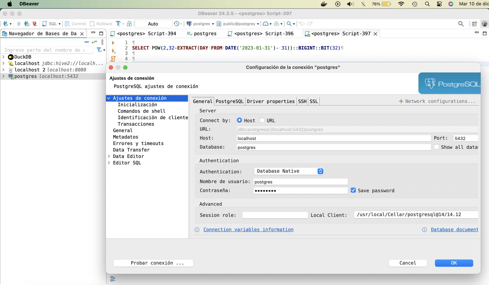
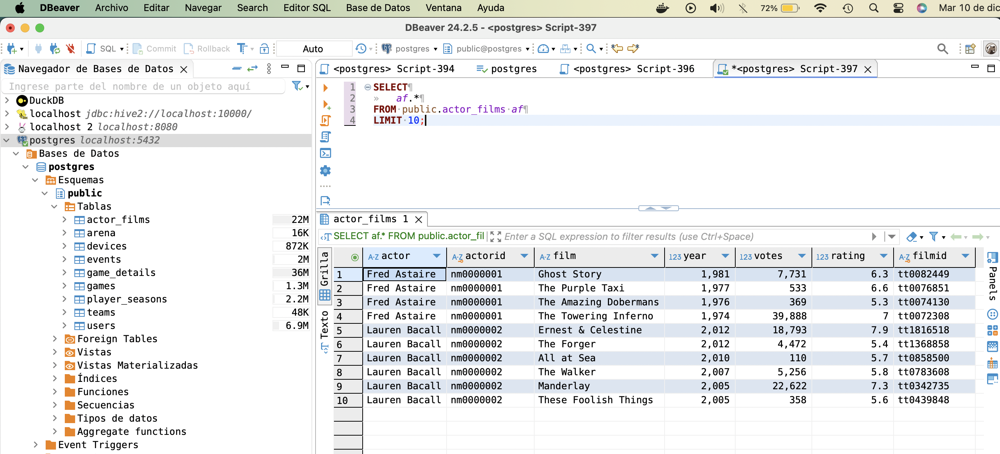
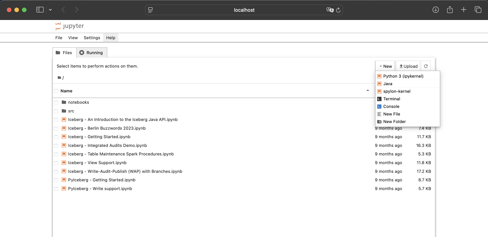
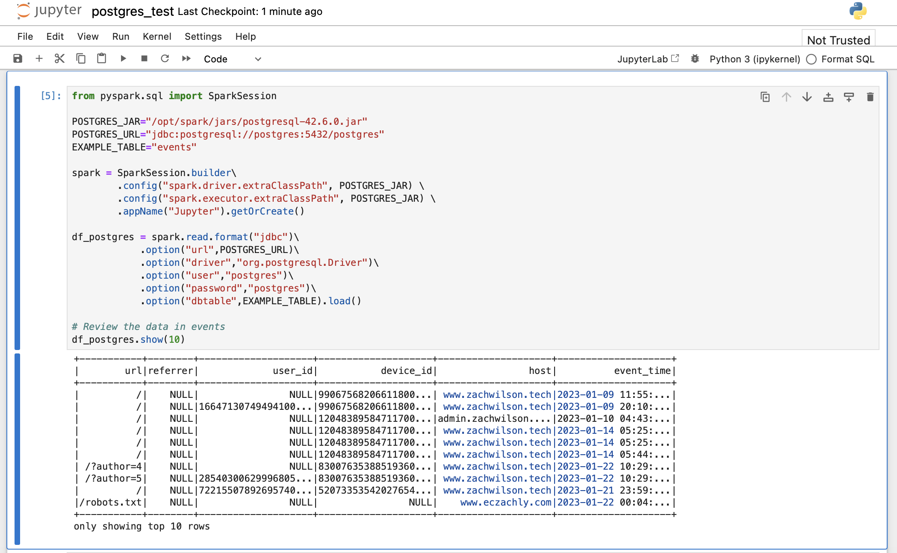
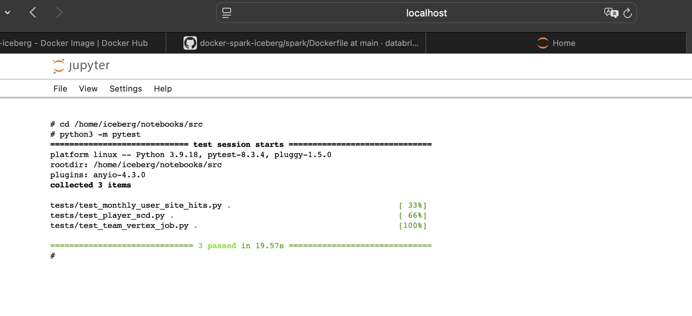

# Data Engineer Handbook - Docker Compose Setup

This repo follows the Bootcamp [Data Engineer Handbook](https://github.com/DataExpert-io/data-engineer-handbook) from [Data Expert.io](https://www.dataexpert.io) by [Zach Wilson](https://www.google.com/url?sa=t&source=web&rct=j&opi=89978449&url=https://www.linkedin.com/in/eczachly&ved=2ahUKEwj46_6Rrp2KAxW3I0QIHZy5F3IQFnoECBgQAQ&usg=AOvVaw0iYPMPUXelavDwUQBDUemf).

The idea is to offer you an alternative setup based on Docker compose
so we interact with 1) postgres, 2) spark and 3) be able to run unit testing with a 
few clicks, and allow you to add some customizations to work with
the Homeworks of the bootcamp.

With this scope in mind, the content is organized as follows:

- [Data Engineer Handbook - Docker Compose Setup](#data-engineer-handbook---docker-compose-setup)
- [Section A: I want to know what is this repo about?](#section-a-i-want-to-know-what-is-this-repo-about)
  - [A.1 Explain me this repo.](#a1-explain-me-this-repo)
  - [A.2 Folder structure](#a2-folder-structure)
  - [A.3 Some remarks](#a3-some-remarks)
- [B. Just let me know what commands to run \& what can I do](#b-just-let-me-know-what-commands-to-run--what-can-i-do)
  - [B.1 How to install \& run?](#b1-how-to-install--run)
- [1. How to connect to Postgres from external tools (e.g. Dbeaver, PGAdmin, etc)?](#1-how-to-connect-to-postgres-from-external-tools-eg-dbeaver-pgadmin-etc)
  - [B.2 How to open a Jupyter Notebook with PySpark or Scala Kernel?](#b2-how-to-open-a-jupyter-notebook-with-pyspark-or-scala-kernel)
  - [B.3 How to interact with Postgres and Spark?](#b3-how-to-interact-with-postgres-and-spark)
  - [B.4 How to run unit testing for HW - Week 3 with Pytest?](#b4-how-to-run-unit-testing-for-hw---week-3-with-pytest)
  - [B.6 How to add new configurations to spark-defaults.conf from the Spark container?](#b6-how-to-add-new-configurations-to-spark-defaultsconf-from-the-spark-container)

# Section A: I want to know what is this repo about?

## A.1 Explain me this repo.

Firstly Zach's Bootcamp provides two different setup:

* **Weeks 1 & 2:** Use a postgres database and load the data from backup file (named as `data.dump`, available in this [link](https://github.com/DataExpert-io/data-engineer-handbook/blob/main/bootcamp/materials/1-dimensional-data-modeling/data.dump))
* **Weeks 3 & 4:**
  * Use a Spark + Apache Iceberg Setup that is based on a Docker Compose provided by Databricks and Tabular (see the [post](https://www.tabular.io/blog/docker-spark-and-iceberg-the-fastest-way-to-try-iceberg/)). This one, is nothing more than a docker compose environment to quickly get up and running with a Spark environment and a local REST catalog, and MinIO as a storage backend. It uses four diffent Docker images:
    * `tabulario/spark-iceberg`: a spark docker image, that allows you to use Spark with Jupyter Notebooks able to run PySpark and Scala (with [Spylon Kernel](https://github.com/vericast/spylon-kernel)). For more information, please see this [repo](https://github.com/databricks/docker-spark-iceberg)
    *  `tabulario/iceberg-rest`:
    *  `minio/minio`: used as a bucket to store the Apache Iceberg data.
    *  `minio/mc`: a container that provides unix-like terminal and that delete all the data & metadata from the bucket.
  * Additionaly, a `requirements.txt` file is given, so we can install some libraries to be able to run unit testing on Spark Jobs using the Pytest Library.
    * This could be odd, since you would need to install spark locally in your pc, and python3.

So in this repo, we just **put all the setup together** within the file `docker-compose.yaml` and add some changes to deploy all the setup in **on a single Docker Compose structure**.

## A.2 Folder structure

In order to do this, we consolidate the following folder structure for the repo:

```
├── .env # The same .env file from Zach's repo
├── Readme.md
├── data 
│   ├── devices.csv
│   ├── events.csv
│   ├── maps.csv
│   ├── match_details.csv
│   ├── matches.csv
│   ├── medals.csv
│   └── medals_matches_players.csv
├── data.dump # Same file from Zach's repo
├── docker-compose.yaml
├── notebooks
│   ├── Caching.ipynb
│   ├── DatasetApi.ipynb
│   ├── bucket-joins-in-iceberg.ipynb
│   ├── event_data_pyspark.ipynb
│   └── postgres_test.ipynb
├── postgres-data
├── scripts
│   └── init-db.sh
├── spark
│   ├── Dockerfile
│   ├── spark-default.conf
│   └── requirements.txt
└── src
    ├── jobs
    └── tests
```

* `data:` contains the .csv files that will be used for HW 3, will be mounted into the container `spark-iceberg` within the path `/home/iceberg/data/`.
* `notebooks:` a folder that contain Jupyter Notebooks to work with, will be mounted into the container `spark-iceberg` within the path `/home/iceberg/notebooks/notebooks`.
* `scripts:` contains a bash scripts that allow you to restore the `data.dump` to postgres, so you can load all the data you will need to play around.
* `postgres-data`: a folder to save the postgres data in your local pc.
* `spark`: a folder that contains a Dockerfile to do customizations on Spark & a the requirements.txt given by Zach, so we can install Chispa, Pytest inside the Spark container. Also, contains the file `spark-defaults.conf` that allow you to define the default configuration parameters for Spark.
* `src:` A folder to write our code on spark jobs and unit test related, it will be mounted into the container `spark-iceberg` within the path `/home/iceberg/notebooks/src`.

## A.3 Some remarks

In addition we have some remarks:

* The repo uses the same `.env` file that the one provided in the [Zach's repo](https://github.com/DataExpert-io/data-engineer-handbook/blob/main/bootcamp/materials/1-dimensional-data-modeling/example.env), this is used by the postgres container. Please make sure to have a copy in the root folder
* Again, the repo it depend on the `data.dump` file provided in the [Zach's repo](https://github.com/DataExpert-io/data-engineer-handbook/blob/main/bootcamp/materials/1-dimensional-data-modeling/data.dump). Don't forget to add it.
* Lastly, given the setup specified in the `docker-compose.yaml` file, the postgres container is **in the same network** than the other containers spark & minio, named as `postgres`. So to reach this database you will have to adjust the host data in your connection
  * External connections: use the host `localhost`
  * Internal connections: use the host `postgres`.


# B. Just let me know what commands to run & what can I do

## B.1 How to install & run?

a. Clone this repository,

b. Make sure to create a `.env` file based in the [example provided by Zach](https://github.com/DataExpert-io/data-engineer-handbook/blob/main/bootcamp/materials/1-dimensional-data-modeling/example.env),

  * For example run:
  ```
  wget https://github.com/DataExpert-io/data-engineer-handbook/blob/main/bootcamp/materials/1-dimensional-data-modeling/example.env && mv example.env .env
  ```

c. Add the `data.dump` file from [Zach's repo](https://github.com/DataExpert-io/data-engineer-handbook/blob/main/bootcamp/materials/1-dimensional-data-modeling/data.dump).
  * For example run:
  ```
  wget https://github.com/DataExpert-io/data-engineer-handbook/blob/main/bootcamp/materials/1-dimensional-data-modeling/data.dump
  ```

Now, to activate the docker compose set up just run:
```
docker-compose up
```
If everything is OK, after a couple of minutes you will be able to interact with the containers. In order to do so, using your web browser you can reach the following:

* [http://localhost:8888](http://localhost:8888): Jupyter Notebook UI within the `spark-iceberg` container. You can create Jupyter Notebooks, run code and interact with the file system here.
* [http://localhost:8080](http://localhost:8080): Spark UI within the `spark-iceberg` container.
* [http://localhost:9001/login](http://localhost:9001/login): MinIO UI. You can access to the Bucket file with the following data `Username: Ad`


Now, if you want deactive it, please execute:

```
docker-compose down
```
*Note:* Depending on your Docker Compose version in MacOS you could change the command `docker-compose` by `docker compose`


# 1. How to connect to Postgres from external tools (e.g. Dbeaver, PGAdmin, etc)?

If you want to use **an external RMDB's** please download one of the following: Dbeaver, PGAdmin, JetBrains, etc. 


Please make sure to use the following connection data:

```
host: localhost
port: 5432
database: postgres
username: postgres
password: postgres
```



**Fig. 1** Example of external connection to Postgres using Dbeaver.

Please note that remember that you will be able to execute querys to following tables in the `public` schema:

* `actor_films`,
* `arena`,
* `devices`,
* `events`,
* `game_details`,
* `games`,
* `player_seasons`,
* `teams` &
* `users`



**Fig. 2** Example of Query to Postgres tables from Zach's Bootcamp using Dbeaver.

## B.2 How to open a Jupyter Notebook with PySpark or Scala Kernel?

In order to be able to run code in Pyspark or Scala, follow this steps:

* Open a new Notebook ([http://localhost:8888](http://localhost:8888) > New),
* Select the related kernel (PySpark -> `Python3`, Scala -> `spylon-kernel`)




## B.3 How to interact with Postgres and Spark?

As we know, the `data.dump` file contains several tables (e.g. `events`, `actors`, etc), and the


In this case, since postgres container lies in the same network that Spark& MinIO make sure to use the following connection data:

```
host: postgres # <-- please note that it not `localhost`!!
port: 5432
database: postgres
username: postgres
password: postgres
```

Also please note that in our setup we use the jar file `postgresql-42.6.0.jar`, if you want to use other just modified the file `spark/Dockerfile`. 

Now, with all this data we can interact with the postgres tables. In the following code we show a snippet using PySpark:

```
from pyspark.sql import SparkSession

POSTGRES_JAR="/opt/spark/jars/postgresql-42.6.0.jar"
POSTGRES_URL="jdbc:postgresql://postgres:5432/postgres"
EXAMPLE_TABLE="events"

spark = SparkSession.builder\
        .config("spark.driver.extraClassPath", POSTGRES_JAR) \
        .config("spark.executor.extraClassPath", POSTGRES_JAR) \
        .appName("Jupyter").getOrCreate()

df_postgres = spark.read.format("jdbc")\
            .option("url",POSTGRES_URL)\
            .option("driver","org.postgresql.Driver")\
            .option("user","postgres")\
            .option("password","postgres")\
            .option("dbtable",EXAMPLE_TABLE).load()

# Review the data in events
df_postgres.show()

# Interacting using the SparkSQL API
df_postgres.createOrReplaceTempView(EXAMPLE_TABLE)

spark.sql("SELECT * FROM events LIMIT 10")
```



## B.4 How to run unit testing for HW - Week 3 with Pytest?

Put all the code of the spark job and its unitary tests within the folders `/home/iceberg/notebooks/src/jobs` and `/home/iceberg/notebooks/src/tests`, respectively.

a. Open a new terminal ([http://localhost:8888](http://localhost:8888) > New > Terminal),

b. Navigate to `src` folder within the terminal:

```
cd /home/iceberg/notebooks/src
```

**Note:** For sure, your code for Spark jobs and its unit testing should be place in to folders `src/jobs` and `src/tests`

c. After that, in the same terminal execute the test with the command:

```
python3 -m test
```



## B.6 How to add new configurations to spark-defaults.conf from the Spark container?

If you want to add new configurations to spark-defaults.conf from the Spark container, just modifed the file `Spark/spark-defaults.conf`.

See the following [reference](https://spark.apache.org/docs/3.5.1/configuration.html) for more information